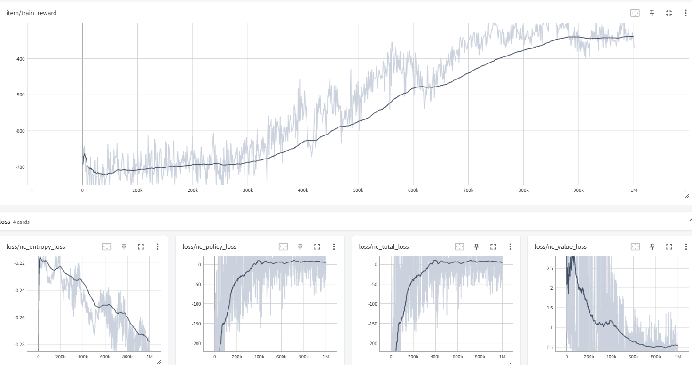
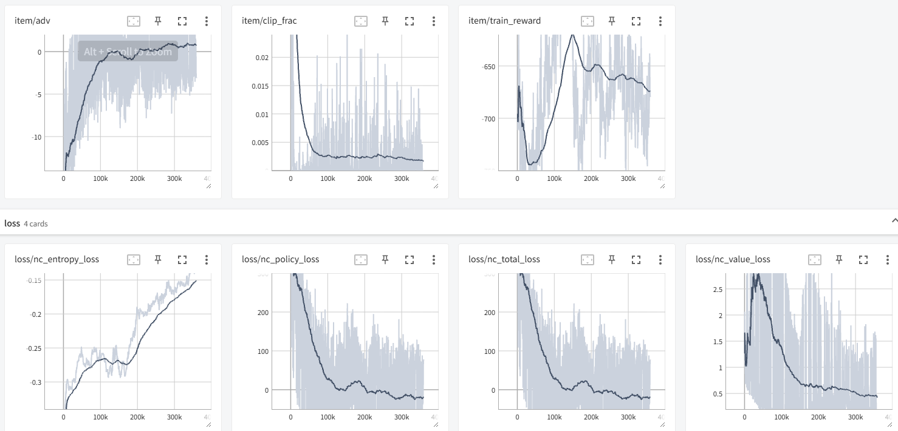

### PPT要求
ATSC Grid 和 ATSC Monaco环境代码参考：deeprl_network/envs/large_grid_env.py & real_net_env.py

1. Independent Advantage Actor Critic （IA2C）
https://ieeexplore.ieee.org/document/8667868
2. Individualized Controlled Continuous Communication Model（IC3Net）
https://github.com/IC3Net/IC3Net
https://arxiv.org/pdf/1812.09755.pdf

https://github.com/PKU-MARL/HARL

具体包括但不限于以下几部分：
一、算法设计，已给出两个基线多智能体算法IA2C和IC3Net，在两个环境中，分别以最小化Intersection delay和最小化Queue length为单个优化目标，并且：
- 1.学习、借鉴基线算法IC3Net，针对给定ATSC实验环境，**给出改进方案或设计新算法**（二选一）并分析改进原因或设计方案，不限于理论，网络结构，实现技巧等方面的改进和设计。对比训练曲线，保存不同算法的模型测试比较最终策略效果。结果图包括但不限于：学习曲线， 最终策略的Intersection delay和Queue length对比
- 2. 学习基线算法IA2C，参考由单智能体A2C算法拓展而来的多智能体IA2C算法，并学习针对ATSC中多智能体系统设计的MA2C算法，**扩展单智能体SAC或单智能体PPO**(二选一)算法为多智能体算法，与IA2C, MA2C对比训练曲线和最终策略效果。结果图要求同1。
二、多目标优化，ATSC的两个环境均有两个优化目标，分别为最小化Intersection delay和最小化Queue length，综合考虑同时优化两个目标，设计综合优化目标的奖励函数，并分析最终策略性能，绘制结果图，可通过可视化分析模拟面板数据优化设计方案。

### 环境配置
https://sumo.dlr.de/docs/Installing/Linux_Build.html 

<!-- sudo apt-get install -y software-properties-common
sudo add-apt-repository ppa:sumo/stable -->
sudo apt-get update
sudo apt-get install sumo sumo-tools sumo-doc

export SUMO_HOME=/usr/share/sumo
export PYTHONPATH=$SUMO_HOME/tools:$PYTHONPATH

cd envs/large_grid_data/
python build_file.py

可视化：
cd envs/large_grid_data
sumo-gui -c exp_0.sumocfg

### 
25个agent。
每个agent动作空间为5：phases = ['GGgrrrGGgrrr', 'rrrGrGrrrGrG', 'rrrGGrrrrGGr','rrrGGGrrrrrr', 'rrrrrrrrrGGG']. 每个12字符控制了该路口的3*4个灯。
状态主要是：node.wave_state. 车流量。
状态空间: 角,边,中 = 36,48,60

env.n_s_ls, env.n_a_ls: 状态空间长度,动作空间长度 
n_n: num_neighbor
env.distance_mask.shape: (25, 25). 各个agent距离.

LstmPolicy 包含了 actor_head 和 critic_head. 
LSTM,batch前后做了state传递. 

train时是直接按概率随机选动作: np.random.choice(np.arange(len(pi)), p=pi)
test时贪心。

action = self.model.forward(ob, done)
value = self.model.forward(ob, done, self.naction, 'v'). 
self._run_critic_head(h, np.array([naction])). critic_head的做法是把 h 和 one_hot(naction) concat. 这是合理的，因为策略梯度定理的baseline中，只要不包含当前agent action即可。

control_interval_sec：5, 黄灯：2

IA2C优化目标：objective = queue. 怎么算的 ???  
Intersection delay：objective=wait. coef_wait
好慢啊。。每次端口不同 ???

### changes
actor_dist = torch.distributions.categorical.Categorical(logits=F.log_softmax(self.actor_head(hs), dim=1)). 错了 !!,不用log_softmax,内部会自己做。

spatial rewards: 对于当前agent, R += (alpha^dis) * reward. 不止考虑当前点的reward.

他的 adv = R-V. 用R估计Q ??? Reinforce ???

### MA2C_NC
ob.shape = 25,12
有了更多邻居信息。
reward共用。直接global_reward = np.sum(reward)了。
MA2C实现是整体一个大的actor、critic. 但具体还是给每个agent配置参数。
感觉不出MARL共用参数在哪。。。
finger_print: 上一次action.

baseline:

去掉done,效果超好:

原先是类似N-step return。
改成 gae+td0. 
朴素的用折扣回报同时作为V_target和Q却能训 ??

只改td0：
也很不错

bad_PPO:

Adam不行，RMScrop行：
Adam 的自适应学习率问题 (尤其是在 RL 中):
历史梯度的累积问题： Adam 通过计算梯度的指数移动平均（一阶矩 m 和二阶矩 v）来自适应地调整学习率。在 RL 训练中，特别是对于策略梯度方法（如 REINFORCE, A2C, PPO），梯度通常具有高方差和非稳态的特性。
高方差意味着单个批次的梯度可能很不稳定。
非稳态意味着梯度分布可能随时间发生显著变化（例如，智能体探索新区域、学到新技能）。
可能导致学习率过早衰减或过大： Adam 可能会根据早期的大梯度（特别是训练初期的探索阶段）计算出较大的二阶矩 v，从而导致后续学习率（lr / sqrt(v)）过早地被抑制，变得过小。这使得智能体在后期难以探索或跳出局部最优。
RMSprop 的特性：
更简单的自适应： RMSprop 也使用梯度的平方的移动平均来调整学习率，但它不使用一阶矩的修正（不像 Adam）。它更专注于解决梯度在不同维度上的尺度差异。
对稀疏梯度的处理： RMSprop 在处理稀疏梯度时可能比 Adam 更稳定一些，因为它没有 Adam 那么复杂的动量累积机制。
学习率的激进性： RMSprop 可能会在某些情况下显得比 Adam 更“激进”，它的学习率可能波动更大，这在 RL 探索过程中有时是有益的。它不像 Adam 那样容易在早期就把学习率固定在某个小值。
对 RL 中基线方差的敏感性：
RL 的梯度通常有高方差，尤其是在早期探索阶段。价值函数（基线）的估计质量直接影响优势函数 Adv 的方差。
如果 Adam 对这种高方差梯度更敏感，可能导致其更新方向不稳定。而 RMSprop 可能会以某种方式（例如，对过去梯度的记忆更短）更好地处理这种不稳定性。

训练时：np.random.choice(np.arange(len(pi)), p=pi)。on-policy, 能否温度之类 

reward_norm = 2000
每个step: global_reward = np.mean(reward)(agent层面上). 递增
tensorboard记录的eposide reward只是对该值再平均。

value_loss基本到0了
loss/nc_policy_loss ??? 
期望的是adv大，但是logprob也大

不同机子上速度严重不同。

测step时间：
  phase_yellow    : 0.0177 seconds
  phase_green     : 0.0196 seconds
  get_state       : 0.0182 seconds
  measure_reward  : 0.0162 seconds
没啥办法。。

MAPPO。理应CTDE。
现在critic没问题，但actor依赖lstm的hs.
另训actor lstm较好，只接受局部输入。
扩大batch_size和采样长度。

Adv归一化：
促进探索与收敛的平衡：
在训练初期，当策略还在探索时，Rs（回报）和 vs（价值预测）可能都比较低，导致 Advs 也很小。如果不归一化，策略几乎得不到有效的学习信号，无法改变其行为。
通过归一化，即使 Advs 的原始值都很小，它们之间的相对大小关系依然被放大，从而为策略提供足够的“推力”来探索和改进，直到找到更高奖励的区域。

test结果。

###
python3 main.py train --config-dir config/config_ia2c_grid.ini 
nohup python3 main.py train > output.log 2>&1 &