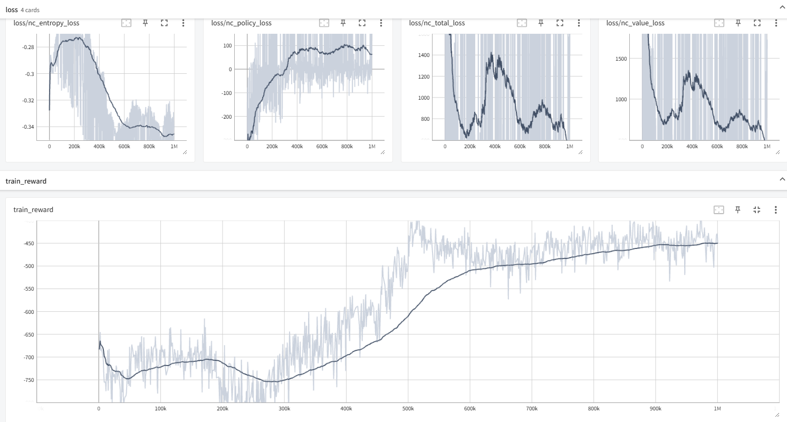

### PPT要求
ATSC Grid 和 ATSC Monaco环境代码参考：deeprl_network/envs/large_grid_env.py & real_net_env.py

1. Independent Advantage Actor Critic （IA2C）
https://ieeexplore.ieee.org/document/8667868
2. Individualized Controlled Continuous Communication Model（IC3Net）
https://github.com/IC3Net/IC3Net
https://arxiv.org/pdf/1812.09755.pdf

https://github.com/PKU-MARL/HARL

具体包括但不限于以下几部分：
一、算法设计，已给出两个基线多智能体算法IA2C和IC3Net，在两个环境中，分别以最小化Intersection delay和最小化Queue length为单个优化目标，并且：
- 1.学习、借鉴基线算法IC3Net，针对给定ATSC实验环境，**给出改进方案或设计新算法**（二选一）并分析改进原因或设计方案，不限于理论，网络结构，实现技巧等方面的改进和设计。对比训练曲线，保存不同算法的模型测试比较最终策略效果。结果图包括但不限于：学习曲线， 最终策略的Intersection delay和Queue length对比
- 2. 学习基线算法IA2C，参考由单智能体A2C算法拓展而来的多智能体IA2C算法，并学习针对ATSC中多智能体系统设计的MA2C算法，**扩展单智能体SAC或单智能体PPO**(二选一)算法为多智能体算法，与IA2C, MA2C对比训练曲线和最终策略效果。结果图要求同1。
二、多目标优化，ATSC的两个环境均有两个优化目标，分别为最小化Intersection delay和最小化Queue length，综合考虑同时优化两个目标，设计综合优化目标的奖励函数，并分析最终策略性能，绘制结果图，可通过可视化分析模拟面板数据优化设计方案。

### 环境配置
https://sumo.dlr.de/docs/Installing/Linux_Build.html 

pip3 install matplotlib
pip3 install seaborn
sudo apt-get install -y software-properties-common
sudo add-apt-repository ppa:sumo/stable
sudo apt-get update
sudo apt-get install sumo sumo-tools sumo-doc

export SUMO_HOME=/usr/share/sumo
export PYTHONPATH=$SUMO_HOME/tools:$PYTHONPATH

To train a new agent:
python3 main.py train 
--config-dir config/config_ia2c_grid.ini 
nohup python3 main.py train > output.log 2>&1 &

cd envs/large_grid_data
sumo-gui -c exp_0.sumocfg

### 
25个agent。
每个agent动作空间为5：phases = ['GGgrrrGGgrrr', 'rrrGrGrrrGrG', 'rrrGGrrrrGGr','rrrGGGrrrrrr', 'rrrrrrrrrGGG']. 每个12字符控制了该路口的3*4个灯。
状态主要是：node.wave_state. 车流量。
状态空间: 角,边,中 = 36,48,60

env.n_s_ls, env.n_a_ls: 状态空间长度,动作空间长度 
n_n: num_neighbor
env.distance_mask.shape: (25, 25). 各个agent距离.

LstmPolicy 包含了 actor_head 和 critic_head. 
LSTM,batch前后做了state传递. 

train时是直接按概率随机选动作: np.random.choice(np.arange(len(pi)), p=pi)
test时贪心。

action = self.model.forward(ob, done)
value = self.model.forward(ob, done, self.naction, 'v'). 
self._run_critic_head(h, np.array([naction])). critic_head的做法是把 h 和 one_hot(naction) concat. 这是合理的，因为策略梯度定理的baseline中，只要不包含当前agent action即可。

fingerprint ??

control_interval_sec：5, 黄灯：2 ??

IA2C优化目标：objective = queue. 怎么算的 ???  
Intersection delay 又怎么算 ???

MA2C是整体一个大的actor、critic. 

### changes
actor_dist = torch.distributions.categorical.Categorical(logits=F.log_softmax(self.actor_head(hs), dim=1)). 错了 !!,不用log_softmax,内部会自己做。

spatial rewards: 对于当前agent, R += (alpha^dis) * reward. 不止考虑当前点的reward.

他的 adv = R-V. 用R估计Q ??? Reinforce ???

len=120的Reward, 在gamma=0.99下极难学习吧。长这样：
tensor([-69.7489, -70.4402, -71.1171, -71.7875, -72.4832, -73.0839, -73.6798,
        -74.2415, -74.8409, -75.4456, -75.9253, -76.3151, -76.7412, -77.1526,
        -77.4858, -77.8846, -78.2816, -78.7351, -79.1618, -79.4981, -79.8997,
        -80.2797, -80.6258, -80.9735, -81.3248, -81.5076, -81.6492, -81.8698,
        -82.0471, -82.2107, -82.2991, -82.2852, -82.1475, -82.0181, -81.8450,
        -81.7885, -81.8350, -81.8160, -81.7028, -81.7887, -81.8683, -81.8490,
        -81.6346, -81.4221, -81.1075, -80.6009, -80.1165, -79.6552, -79.0324,
        -78.5191, -78.1189, -77.6877, -77.0819, -76.6679, -76.0978, -75.4303,
        -74.6596, -73.9591, -73.3109, -72.6233, -72.0334, -71.6392, -71.0008,
        -70.0177, -69.0611, -68.1195, -66.9942, -65.8168, -64.7913, -63.6576,
        -62.5505, -61.5882, -60.8421, -60.1005, -59.1659, -57.9727, -56.8567,
        -55.8505, -55.0008, -54.2697, -53.3540, -52.3746, -51.3893, -50.4549,
        -49.3567, -48.1506, -46.8055, -45.4367, -44.2153, -43.0017, -41.8577,
        -40.6214, -39.2211, -37.6953, -36.4152, -35.0935, -33.7122, -32.4184,
        -31.1424, -29.5905, -27.9480, -26.3960, -25.0241, -23.8951, -22.9309,
        -21.7455, -20.5002, -19.1897, -17.8667, -16.4078, -14.9333, -13.5637,
        -12.1993, -10.7008,  -9.4695,  -8.2287,  -6.7087,  -5.0855,  -3.4865,
         -1.9217])

Adam

### MA2C_NC
baseline:

改成 gae+td0. 
期望的V值: